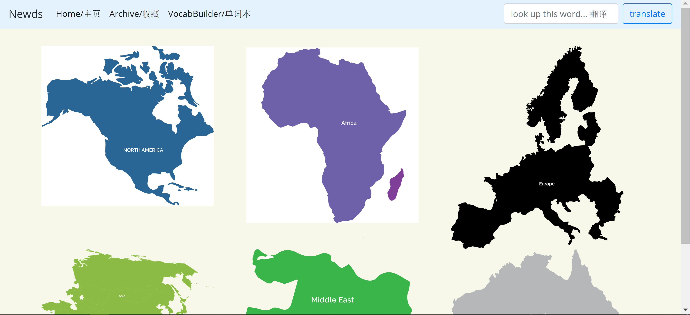
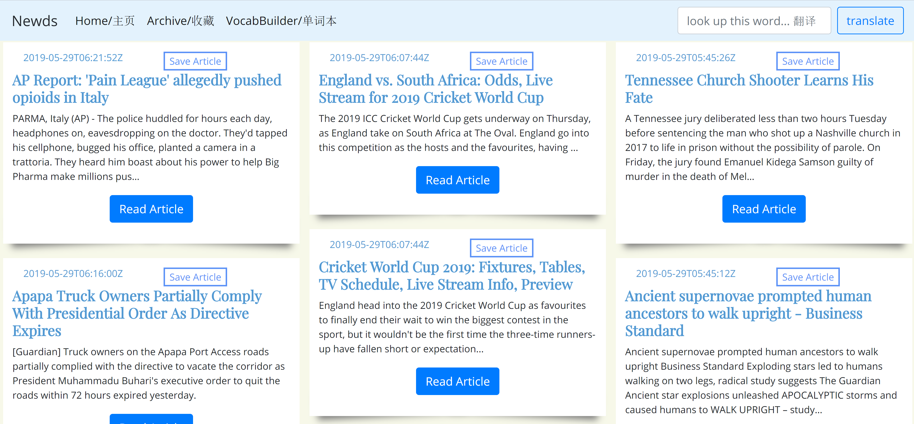
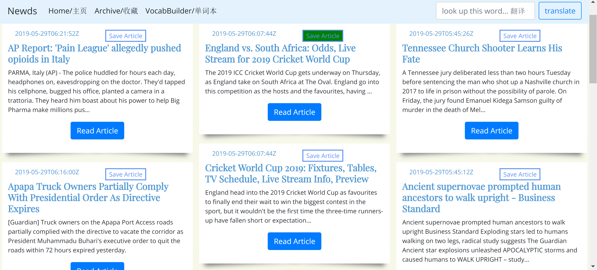
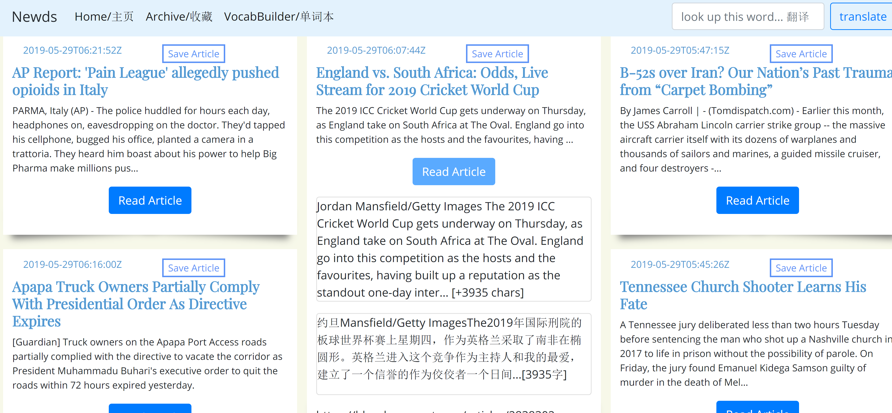
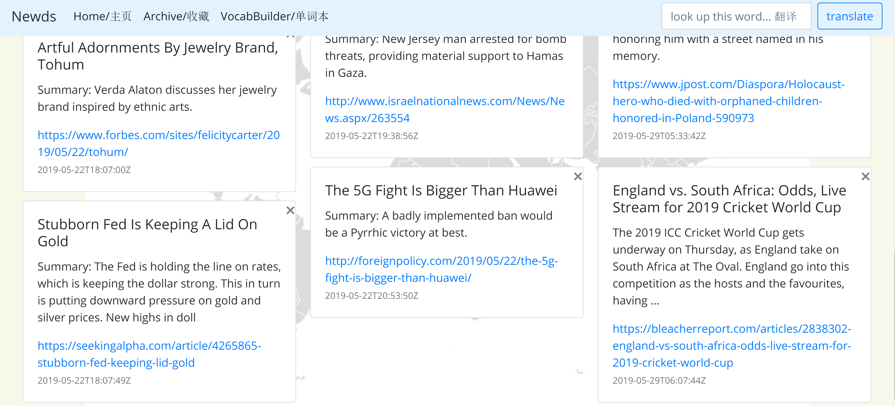

Milestone 5

Our application would be catered to students outside of America trying to learn and improve on their English. With the application, they would be able to view trending articles and read them, allowing them to stay updated with what is happening around the world. In cases when they do not understand something, they are able to utilize the translation feature in order to learn what it means. Not only that, but when the user encounters an interesting read or a word they may want to look back at in the future, then they have the option to save it for future reference.

Revised Map: 
 
Description: This is the Landing page's visual change.
  

Revised Article Page: 
 
Description: This is the revised article page, which is now displayed more neatly.
 

The screenshots reflect the improvements upon the previous milestone as the articles are now displayed more neatly, and the text has been truncated to eliminate wordiness. 

Save Functionality: 
 
Description: With the save functionality, users can save data directly to the database.
  

Translations: 
 
Description: This is the translation function.
  

Archive Page: 
 
Description: This is the Archive page.
 

We were able to implement the initial data display visualtions with the use of handlebars and displaying each page according to which "href" was used. For this milestone, we then improved upon it by implementing the Masonry.js library allowing us to display the articles and notecards in a more organized format.

  

Possible future changes: 
In order to polish our application, we are planning on making the articles and notecards display in a more uniformed manner, making the data visualtion more symmetric and organized. If possible, we may include a way to save vocabulary words directly from the articles itself, eliminating the need for the user to shift back and forth between one functionality and the other. 
